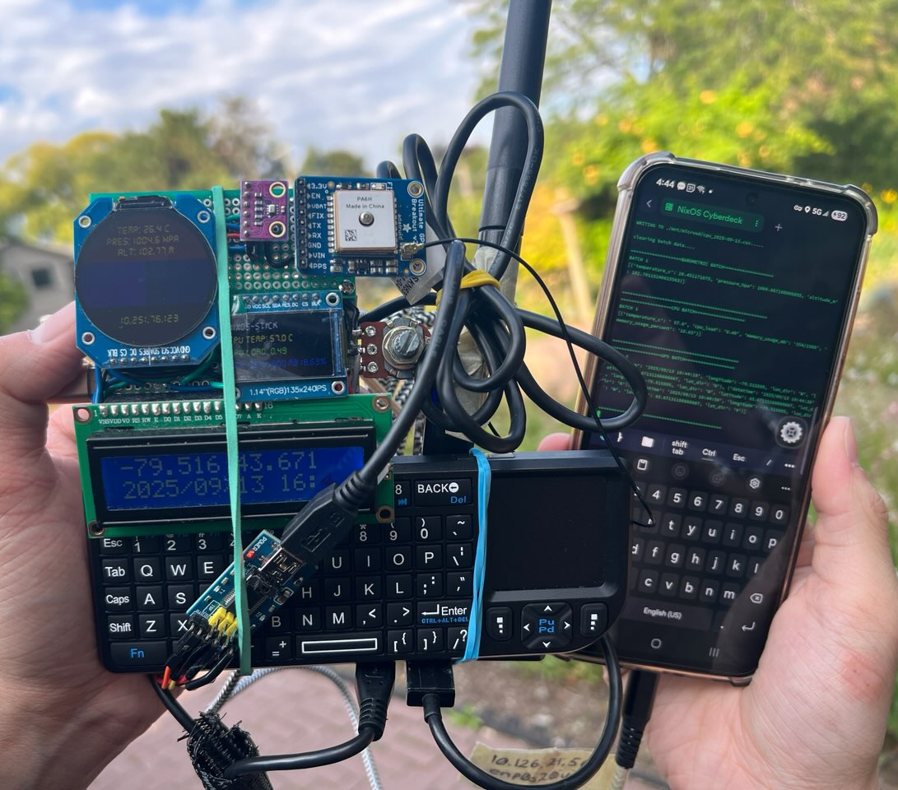
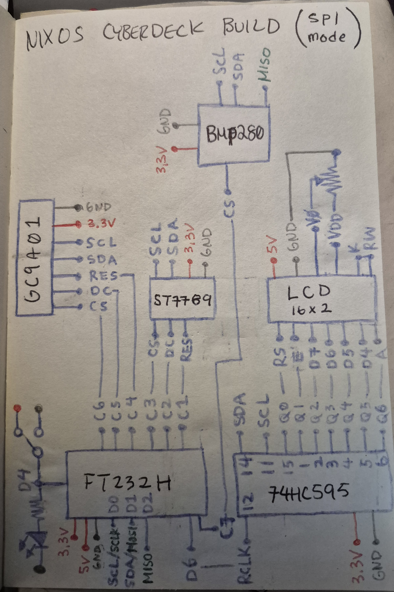
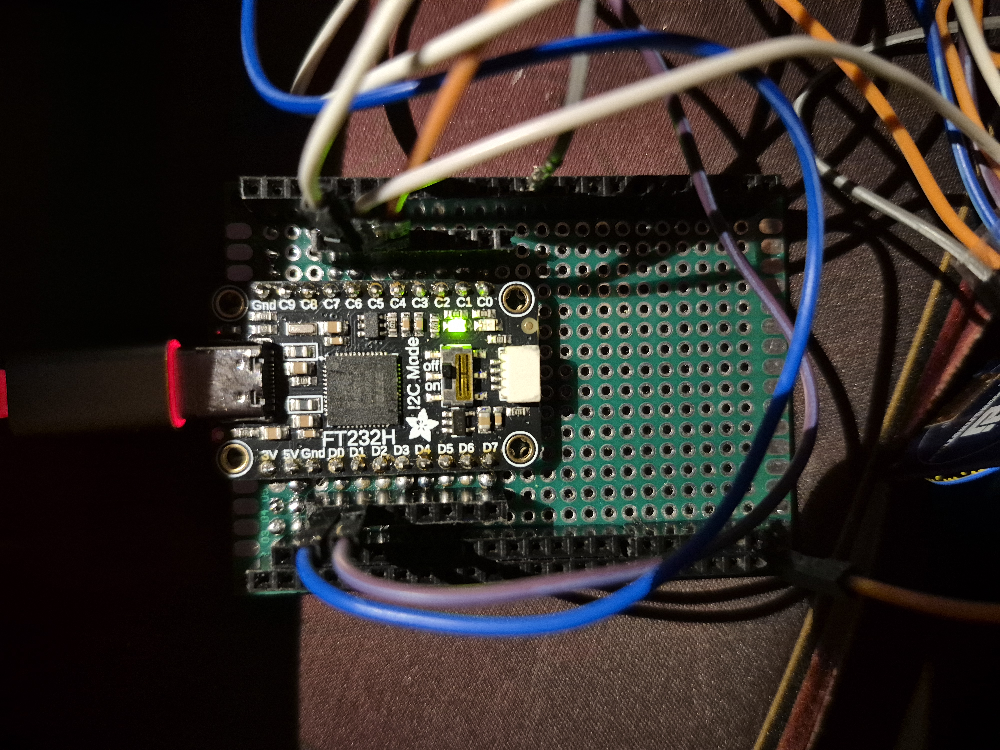
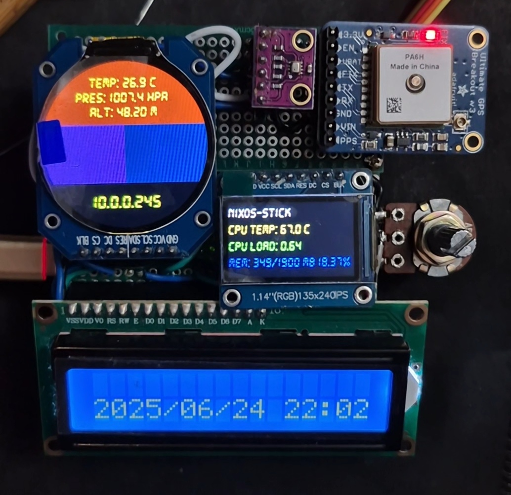
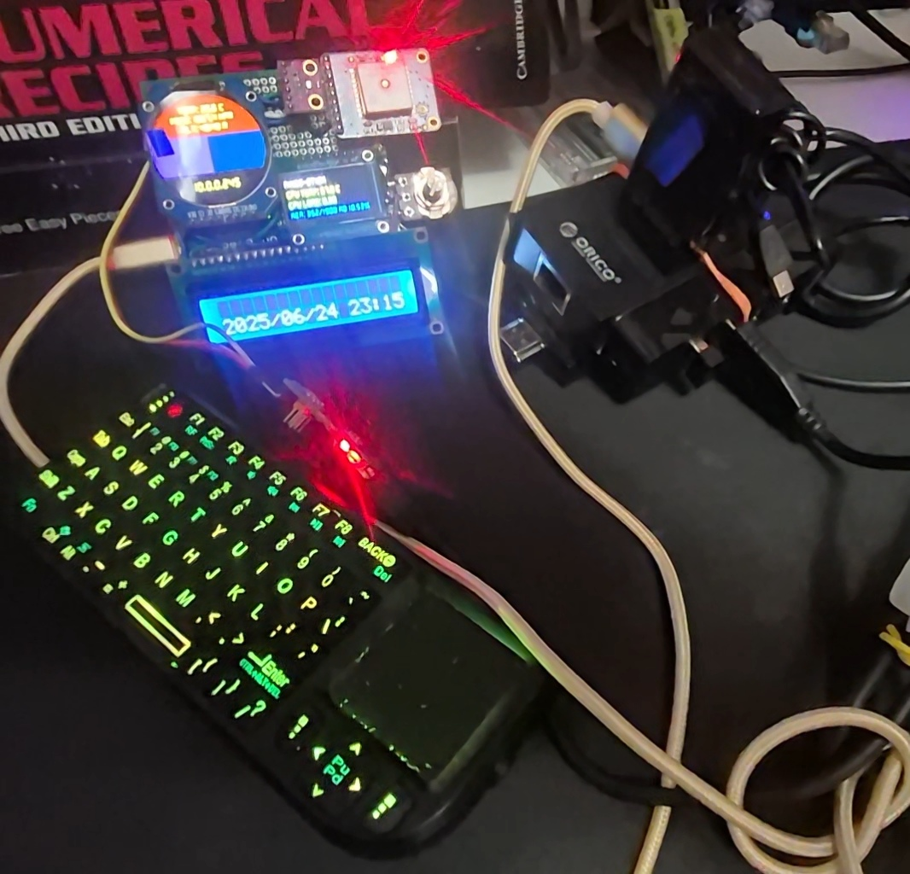

# NixOS Cyberdeck 
A cyberdeck project based on the **Intel Compute Stick** that is running **NixOS**. 


https://github.com/user-attachments/assets/1449d1bb-dcd8-46d2-952f-5a30e3d01839

#### Field Testing


### Directory:
* [NixOS Database Analysis](./analysis/)

## Background

### Intel Compute Stick
The **[Intel Compute Stick (STK1AW32SC)](https://www.intel.com/content/www/us/en/products/sku/91065/intel-compute-stick-stk1aw32sc/specifications.html)** purpose was for media center applications, it has a convenient HDMI connector that can be directly plugged into any compatible monitor and TV.

Its main onboard specifications features:
* **4 CPU cores at 1.44 GHz**
* **32GB eMMC** and **2GB DDR3L-1600 RAM**
* **1 USB 2.0** and **1 USB 3.0** ports
* **MicroSDXC slot**

Although moderate in today standards, it is suitable enough for a *cyberdeck* based system.

### NixOS
The purpose of choosing **[NixOS](https://nixos.org/)** was because of its **reproducible system configurations** where it is easy to moveover to another machine. Allowing simple backups in scenarios where the cyberdeck were to encounter fatal issues.

The package manager makes it where the **build and development enviroments** can be properly separated and accessible without experiencing issues and interference with software tools. In my case, I can modify and/or activate environments based on what the cyberdeck needs to work on both hardware and software.

I have made several blog posts documenting my journey on the PC sticks:
1. [Discovering the Intel Compute Stick](https://bnzel.github.io/2024-08-03-Intel-Compute-Sticks/)
2. [Booting Ubuntu Server and NixOS onto the stick](https://bnzel.github.io/2024-08-07-ServerDeck-and-NixOS/)
3. [Breadboard prototyping the NixOS stick](https://bnzel.github.io/2025-04-07-NixOS-CyberDeck/)
4. [Latest iteration of the NixOS cyberdeck build](https://bnzel.github.io/2025-07-09-NixStick-Update/)

I list all software and hardware configurations, as well as documenting fixes issues too, though this README serves as a more thorough documentation. 

## Cyberdeck Introduction
This section will explain the *why?* and *how?* of my current build.

As I am limited by Intel's proprietary hardware, modifications are only on software tools, hardware addons, and the software written to run the hardware stack. 

### Hardware Addon

* **[Orico USB3.0 Hub with Gigabit Ethernet Converter](https://www.orico.shop/en/orico-usb30-hub-with-gigabit-ethernet-converter.html)** OR **[UNITEK H1117A02 4 Ports USB-A 3.0 Hub](https://www.canadacomputers.com/en/usb-hubs/260566/unitek-4-ports-usb-a-3-0-hub-h1117a02.html)** *(recommended as there is an external power supply to avoid pulling current from the deck itself)*
* **[Riitek Wireless Keyboard V3](http://www.riitek.com/product/221.html)**
* **USB Hub Voltage & Current Tester**
* **[AdaFruit FT232H (USB-C)](https://learn.adafruit.com/adafruit-ft232h-breakout)**
* **FTDI FT232RL USB to TTL adapter**

> At times the USB hub causes overvoltage and can crash the system when booting. Removing it before plugging it ensures a safe bootup. 

The **Orico USB hub** had conflicts between the ethernet port and the Intel's built-in wireless chip that created this issue:
```
iwlwifi 0000:01:00.0: Microcode SW error detected. Restarting 0x2000000
```
So in [configuration.nix](./configurations/configuration.nix):
```
  environment.etc."modprobe.d/iwlwifi.conf".text = ''
    options iwlwifi 11n_disable=1
    options iwlwifi power_save=0
  '';
```

There were other issues regarding the **5V/3A** adapter that I don't recall as I had to do alot of trial and error in **[hardware-configuration.nix](./configurations/hardware-configuration.nix)**:
```
boot.blacklistedKernelModules = ["i2c-designware-platform" "i2c-designware-core" "axp20x" "axp20x_i2c" "axp288_charger "];
```

### Custom Hardware
The **FT232H** is the main driver of the following components:
* **Displays**:
    * **GC9A01** (round display)
    * **ST7789** (square display)
    * **16x2 LCD** (rectangle display) and a **potentiometer** to adjust backlight
* **[BME280 (Barometric sensor)](https://www.bosch-sensortec.com/products/environmental-sensors/humidity-sensors-bme280/)**
* **[AdaFruit Ultimate GPS V3](https://learn.adafruit.com/adafruit-ultimate-gps)**
* **[74HC595 Shift Register](https://learn.adafruit.com/74hc595/overview)**

The **FTDI cable** is to power and receive serial communication with the **GPS**. The **GPS** provides a smooth **3.3V** to power the **BMP280** to avoid voltage spikes that may interfere the sensor accuracy.

The **BMP280** had encountered an error where the chip is not recognized. This was due to a **CS** pin issue from the **FT232H** that I was not able to pinpoint the reason. I switch it from **C7** to **D7**.

**GC9A01** is to display data from **BMP280**, **ST7789** to view the cyberdecks cpu: temperature, load, memory resource. The **LCD** shows date-time and **GPS** location. 



A **SPST switch** in **D4** was suppose to be to activate a webcam stream but was not necessary for the moment.

In my blog post, I mentioned wanting a more compact design, so my approach was to make it stackable:

#### First Layer:
This were the FT232H sits, it will provide pins and **5V**, **3.3V**, **GND** pins to the second layer.




#### Second Layer:
All sensors and displays will sit here. There's another small protoboard above to give the BMP280 and GPS space.




### Software
In the **[configurations.nix](./configurations/configuration.nix)** file:

Nix packages I use:
```
   environment.systemPackages = with pkgs; [
     wget
     htop
     fastfetch
     zsh
     oh-my-zsh
     git
     linux-firmware
     linux-wifi-hotspot
     tmux
     busybox
     cockpit
     libusb1
   ];
```
My mostly used tools are **zsh** for its autocomplete and highlighting features, **cockpit (runs on port 9090)** for a more graphical approach to my headless setup and to view system health, and **tmux** to view dmesg logs and starting scripts within one terminal.

Creating a separate Python environment in NixOS is different from other Linux distros, I came across this **[template](https://github.com/NixOS/nixpkgs/blob/49829a9adedc4d2c1581cc9a4294ecdbff32d993/doc/languages-frameworks/python.section.md#how-to-consume-python-modules-using-pip-in-a-virtual-environment-like-i-am-used-to-on-other-operating-systems-how-to-consume-python-modules-using-pip-in-a-virtual-environment-like-i-am-used-to-on-other-operating-systems)** from their official **[Github](https://github.com/NixOS)** that I **[modified](./configurations/default.nix)**.

**OpenCV** was not used but can be useful for linking important **cpp .so** files:
```
LD_LIBRARY_PATH = lib.makeLibraryPath [ pkgs.stdenv.cc.cc ];
```
Addtional packages for the environment. **screen** to view serial data, **gcc** to compile C/C++ files for potential projects, **pkg-config** if linking more object files are needed:
```
packages = [ pkgs.screen pkgs.gcc pkgs.gnumake pkgs.pkg-config pkgs.openssl ];
```

[sanity_test.py](./software/sanity_test.py) is to check whether both the FT232H and FTDI cables are properly connected. Troubleshooting that first avoids assuming a USB hub issue.

FT232H runs on **[Adafruit_Blinka](https://github.com/adafruit/Adafruit_Blinka)** and at the moment, **adafruit-blinka** is not on nixpkgs so [requirements.txt](./software/requirements.txt) will do. Libraries for 75HC595 shift register, processing serial data for the FTDI, and displays will also be in the txt file.

#### [Custom Hardware Driver](./software/main.py)
```python

import board
from board import SCK, MOSI, MISO

import busio
import digitalio
from adafruit_rgb_display.st7789 import ST7789
from PIL import Image, ImageDraw, ImageFont

from adafruit_rgb_display.gc9a01a import GC9A01A

import adafruit_bmp280

import numpy as np
import cv2 as cv
import asyncio
import os

import time
import subprocess

import adafruit_character_lcd.character_lcd as character_lcd
import adafruit_74hc595

import wws_74hc165

import serial
import usb.core
import sys
import pynmea2
import datetime
import random

spi = busio.SPI(clock=SCK, MOSI=MOSI, MISO=MISO)

def init_display(disp,cs,dc,reset,rotate,w,h,x_off,y_off,BAUDRATE=24000000):
    CS_PIN = cs
    DC_PIN = dc
    RESET_PIN = reset
    display = disp(
        spi,
        rotation=rotate,
        width=w,
        height=h,
        x_offset=x_off,
        y_offset=y_off,
        baudrate=BAUDRATE,
        cs=digitalio.DigitalInOut(CS_PIN),
        dc=digitalio.DigitalInOut(DC_PIN),
        rst=digitalio.DigitalInOut(RESET_PIN)
    )
    return display

def rotation(display):
    height=0
    width=0
    if display.rotation % 180 == 90:
        height = display.width  # swap height/width to rotate it to landscape
        width = display.height
    else:
        width = display.width  # swap height/width to rotate it to landscape
        height = display.height

    return height, width

def draw_image(disp,width,height,fill=0):
    disp.fill(0)
    disp_image = Image.new("RGB", (width,height))
    disp_draw = ImageDraw.Draw(disp_image)

    return disp_image, disp_draw

async def bmp280_task():
#    if btn_toggle.value is False:
        gca_draw.rectangle((0, 0, disp_gc9a01.width, disp_gc9a01.height // 2 - 30), fill=(155, 50, 0))
        gca_txt_bmp_temp = "    Temp: {:.1f} C".format(bmp280.temperature) + "\nPres: {:.1f} hPa".format(bmp280.pressure) + "\n    Alt: {:.2f} M".format(bmp280.altitude)
        gca_draw.text(
            (disp_gc9a01.width // 2 - 70 , disp_gc9a01.height // 2 - 100),
            gca_txt_bmp_temp,
            font=gca_bmp_font,
            fill=(255, 255, 0),
        )
#        gca_draw.text(
#	    (disp_gc9a01.width//2-70, disp_gc9a01.height//2-100),
#	    f"{random.randint(0,100)}",
#	    font=gca_font,
#            fill=(255,255,0),
#        )
        disp_gc9a01.image(gca_image)

async def cam_task():
    if btn_toggle.value is True:
        ret,frame = cap.read()

        if not ret:
            print("Can't receive frame (stream end?). Exiting...")
            os._exit(1)

        resize = cv.resize(frame, (disp_gc9a01.width, disp_gc9a01.height), interpolation=cv.INTER_AREA)
        rgb = cv.cvtColor(resize, cv.COLOR_BGR2RGB)
        pil = Image.fromarray(rgb)
        disp_gc9a01.image(pil)

async def async_main():
   # await asyncio.gather(bmp280_task(),cpu_task(),cam_task(),gps_task())
   await asyncio.gather(bmp280_task(),cpu_task(),gps_task())

async def cpu_task():
    st7789_draw.rectangle((0, 0, width, height), outline=0, fill=0)

    # REFERENCE: https://unix.stackexchange.com/questions/119126/command-to-display-memory-usage-disk-usage-and-cpu-load
    hostname = subprocess.check_output("hostname",shell=True).decode("utf-8")
    cpu_temp = subprocess.check_output("cat /sys/class/thermal/thermal_zone1/temp |  awk '{printf \"CPU Temp: %.1f C\", $(NF-0) / 1000}'",shell=True).decode("utf-8")
    cpu_load = subprocess.check_output("top -bn1 | grep load | awk '{printf \"CPU Load: %.2f\", $(NF-2)}'",shell=True).decode("utf-8")
    mem = subprocess.check_output("free -m | awk 'NR==2{printf \"Mem: %s/%s MB %.2f%%\", $3,$2,$3*100/$2 }'",shell=True).decode("utf-8")

    st7789_draw.text((x,y+10),hostname,font=st7789_font, fill="#FFFFFF")
    st7789_draw.text((x,y+40),cpu_temp,font=st7789_font, fill="#FFFF00")
    st7789_draw.text((x,y+70),cpu_load,font=st7789_font, fill="#00FF00")
    st7789_draw.text((x,y+100),mem,font=st7789_font, fill="#000FF0")

    # display it by 90 deg
    disp_st7789.image(st7789_image)

async def gps_task():

#    lcd.message = "Hello World!"
#    print(lcd.message)

    # TODO: Find a way to retrieve FTDI name, locate the port
    #       and use that. Check if it is open, otherwise continue 
    with serial.Serial("/dev/ttyUSB1", 9600, timeout=1) as ser:

        data = ser.readline().decode('ascii', errors='replace')
        dt = datetime.datetime.now().strftime("%Y/%m/%d %H:%M")

        if(data[0:6] == "$GPRMC"):
            lcd.clear()

            gps_data = pynmea2.parse(data)

            lon = gps_data.longitude
            lat = gps_data.latitude

            lcd.message = "Lon:{0} Lat:{1}".format(lon,lat)
            print(lcd.message)

        lcd.message = "\n{0}".format(dt)

if __name__ == "__main__":
    # REMINDER: THIS SCRIPT IS IN ONLY SPI MODE!
    #           (SINCE THE FT232H UART/MPSSE OPERATES IN ONE SPECIFIC MODE)

    # -----74HC165 IS INPUT ONLY-----
    #_74hc165_isr_latch = board.D5
    #_74hc165_isr = wws_74hc165.ShiftRegister74HC165(spi, _74hc165_isr_latch, 1)

    # -----74HC595 IS OUTPUT ONLY-----
    _74hc595_isr_latch = digitalio.DigitalInOut(board.D6)
    _74hc595_isr = adafruit_74hc595.ShiftRegister74HC595(spi, _74hc595_isr_latch, 1)

    # connecting LCD to 74HC595 
    lcd_rs = _74hc595_isr.get_pin(0)
    lcd_en = _74hc595_isr.get_pin(1)
    lcd_d7 = _74hc595_isr.get_pin(2)
    lcd_d6 = _74hc595_isr.get_pin(3)
    lcd_d5 = _74hc595_isr.get_pin(4)
    lcd_d4 = _74hc595_isr.get_pin(5)

    lcd_backlight = _74hc595_isr.get_pin(6)

    lcd_columns = 16
    lcd_rows = 2

    lcd = character_lcd.Character_LCD_Mono(lcd_rs, lcd_en, lcd_d4, lcd_d5, lcd_d6, lcd_d7, lcd_columns, lcd_rows, lcd_backlight)
    lcd_backlight.value = True
    lcd.message = "BOOTING\nUP..."

    # clear old outputs for incoming ones
    subprocess.run(["clear"])

    # switch for camera mode for round display
#    btn_toggle = digitalio.DigitalInOut(board.D4)
#    btn_toggle.direction = digitalio.Direction.INPUT

    # list connected USB devices
    print("ls /dev/video* : ",subprocess.check_output("ls /dev/video* | grep -oP '/dev/video\d+' | tr '\n' ' ' | sed 's/ $//'",shell=True))
    print("ls /dev/ttyUSB* : ",subprocess.check_output("ls /dev/ttyUSB* | grep -oP '/dev/ttyUSB\d+' | tr '\n' ' ' | sed 's/ $//'",shell=True))

    # camera check
#    cap = cv.VideoCapture(-1)
#    if not cap.isOpened():
#        print("Cannot open camera...")
#    cap.set(cv.CAP_PROP_FPS,30)

    # barometer setup for round display
    bmp280_cs = digitalio.DigitalInOut(board.D7)
    bmp280 = adafruit_bmp280.Adafruit_BMP280_SPI(spi, bmp280_cs)
    bmp280.sea_level_pressure = 1017.0
    gca_bmp_font = ImageFont.truetype('./DS-DIGIT.TTF',20)

    # ----------------set up round display ----------------
    disp_gc9a01 = init_display(GC9A01A,board.C6,board.C5,board.C4,180,240,240,0,0)
    gca_image, gca_draw = draw_image(disp_gc9a01,disp_gc9a01.width,disp_gc9a01.height)

    gca_draw.rectangle((0, 0, disp_gc9a01.width, disp_gc9a01.height // 2 - 30), fill=(155, 50, 0))                          # upper rectangle
    gca_draw.rectangle((0, 90, disp_gc9a01.width // 2, disp_gc9a01.height // 10 + 150), fill=(105, 50, 150))                # left rectangle
    gca_draw.rectangle((120, 90, disp_gc9a01.width // 2 + 150, disp_gc9a01.height // 10 + 150), fill=(10, 50, 100))         # right rectangle

    gca_font = ImageFont.truetype('./DS-DIGIT.TTF',25)
    gca_txt_ip = subprocess.check_output("ip -4 addr | grep -oP '(?<=inet\s)\d+(\.\d+){3}' | grep -v '127\.0\.0\.1'",shell=True).decode("utf-8")
    gca_draw.text(
        (disp_gc9a01.width // 2 - 50 , disp_gc9a01.height // 2 + 70),
        gca_txt_ip,
        font=gca_font,
        fill=(255, 255, 0),
    )
    disp_gc9a01.image(gca_image)
    # ------------------------------------------------------


    # ---------------- set up tft display ----------------
    x = 0
    y = -2
    disp_st7789 = init_display(ST7789,board.C3,board.C2,board.C1,90,135,240,53,40)
    height,width = rotation(disp_st7789)
    st7789_image, st7789_draw = draw_image(disp_st7789,width,height)
    st7789_font = ImageFont.truetype('./DS-DIGIT.TTF',23)
    # ------------------------------------------------------

    lcd.clear()

    # gracefully exit when CTRL+C
    try:
        while True:
            asyncio.run(async_main())

    # offload camera, lcd, and exit
    except KeyboardInterrupt:
 #       cap.release()
        lcd.clear()
        lcd.backlight = False
        os._exit(1)
        print("\nCancelled...")
```

## Latest Setup


