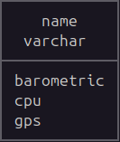
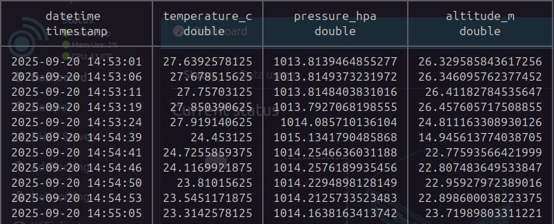
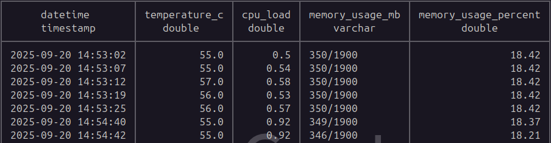
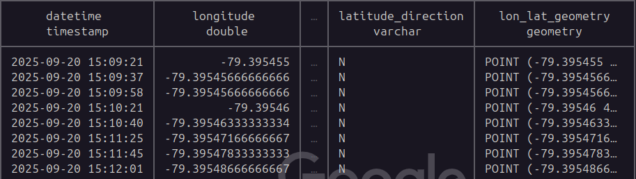

# NixOS Database Analysis
This is a separate **Intel Compute Stick** tp perform data analysis on the [NixOS Cyberdeck](../README.md). The purpose is to have a **portable embedded database** to store and process data (CPU, GPS, Barometric sensors). While this setup can be installed on the same device it's best to differentiate the task to avoid confusion and overhead.

## Setup
* **[cyberdeck_analysis.ipynb](./cyberdeck_analysis.ipynb)**
* **cyberdeck.db**
* **[default.nix](./default.nix)**
* **[requirements.txt](./requirements.txt)**

In **default.nix** the following packages will be installed:
```
    # main data analysis tools
    pythonPackages.pandas
    pythonPackages.matplotlib
    pythonPackages.numpy
    pythonPackages.requests

    # optional but recommended
    packages = [ pkgs.screen pkgs.gcc pkgs.gnumake pkgs.pkg-config pkgs.openssl ];

    # needed to load jupyter notebook server
    LD_LIBRARY_PATH = lib.makeLibraryPath [ pkgs.stdenv.cc.cc ];
```
> The Jupyter NixOS package currently has issues, a post made in this [github issue](https://github.com/NixOS/nixpkgs/issues/255923) suggested to use the pip environment to install Jupyter. 

Python packages that aren't avaliable in Nix packages can be installed through ```pip install -r requirements.txt```:
* **GPS:** **[Geopandas](https://geopandas.org/en/stable/)** and related libraries
* **[DuckDB](https://duckdb.org/)**

### **DuckDB**:
Tables are already made for each hardware component. Data has been recorded and can be used as sample data. 
**<sub>(The **device** table is currently not used but it is for keeping track of hardware. **device_id** is a foreign key that is from the **device** table.)</sub>**

#### Tables


#### Device Table


#### Barometric Table


#### CPU Table


#### GPS Table
Filtered for values that aren't non-zeroes. **SPATIAL** extension is needed to display the **lon_lat_geometry** column.



### Geopandas
In the **[notebook](./cyberdeck_analysis.ipynb)**. The following shows recorded GPS points being plotted on two methods (explained in the comments):
#### Matplotlib


#### Geopandas 
