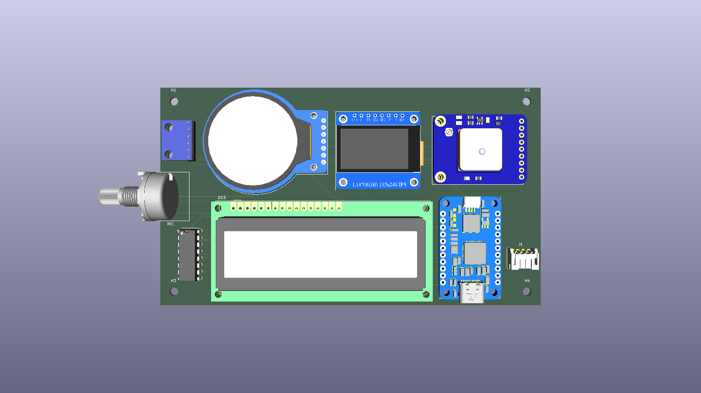
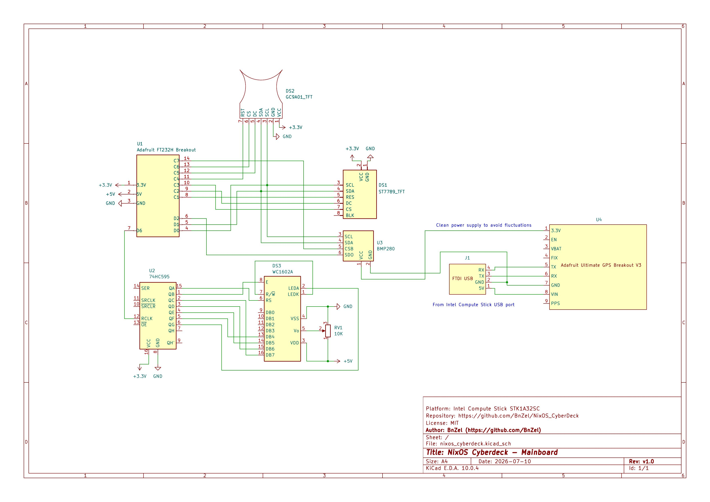
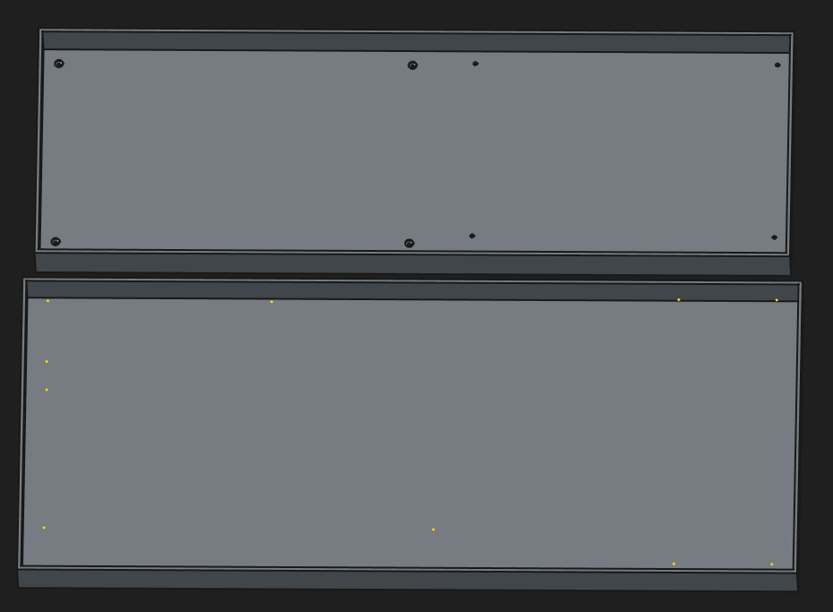

# Hardware Designs

A reference page to document iterations of **schematic**, **PCB** and **CAD** designs. 

Tools used are **[KiCAD](https://www.kicad.org/)** and **[FreeCAD](https://www.freecad.org/)**

### [Version 1](./v1/)

