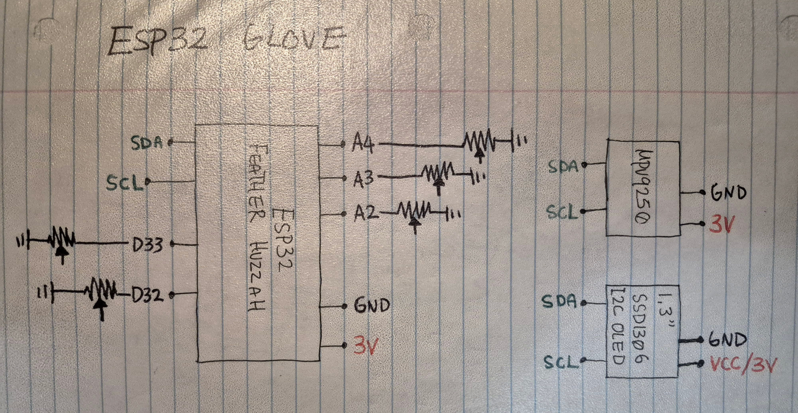
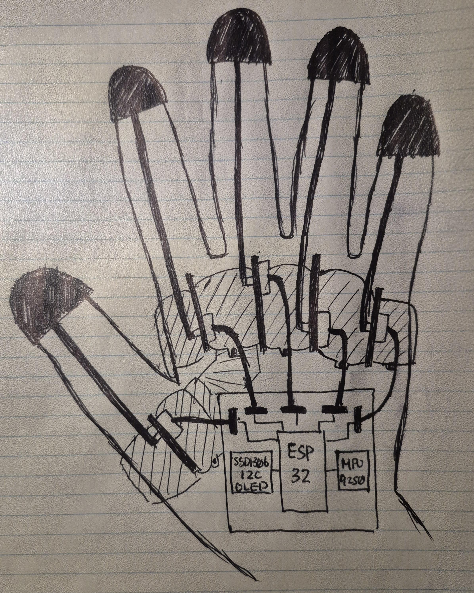
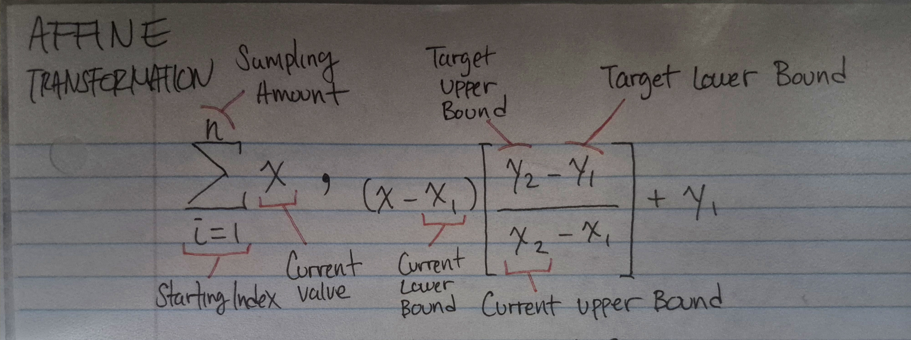
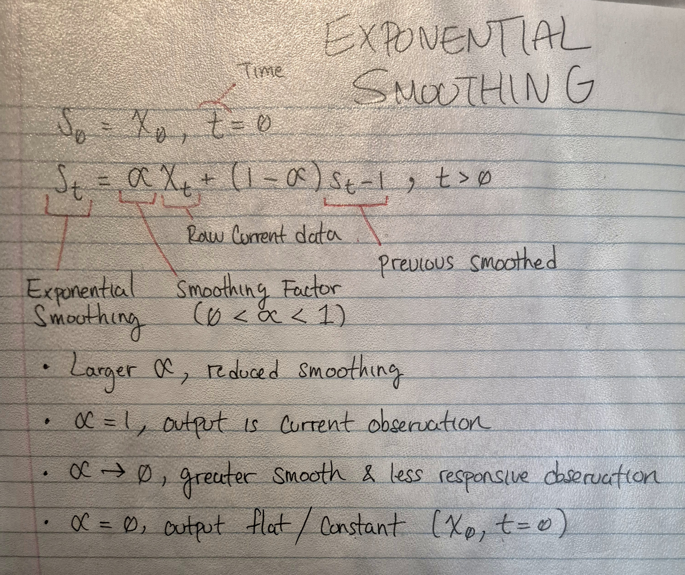

# ESP32 Glove

A custom sensor glove based on the [Adafruit ESP32 Feather Huzzah](https://learn.adafruit.com/adafruit-huzzah32-esp32-feather?view=all) that is connected to the cyberdecks TCP server. It is programmed in **[MicroPython](https://micropython.org/)**.

The glove is based on the [Potentiometer Glove Model](https://www.thingiverse.com/thing:2782111) on Thingiverse.

I have made posts on my blog documenting my two iterations of the glove:
* [Sensor Glove V1](https://bnzel.github.io/2024-11-13-Crude-Sensor-Glove/)
* [Sensor Glove V2](https://bnzel.github.io/2025-07-10-Sensor-Glove-V2/)

### Demo


### Hardware
* **[Adafruit ESP32 Feather Huzzah](https://learn.adafruit.com/adafruit-huzzah32-esp32-feather?view=all)**
* **[Potentiometer Glove Model](https://www.thingiverse.com/thing:2782111)**
* **1.3" I2C OLED (SSD1306)**
* **MPU9250**
* **5x Rotary Potentiometers**


### Software
#### Libraries:
* [SSD1306 Library](https://github.com/Eivs/micropython-ssd1306-oled-1.3-drivers)
* [MPU9250 Library](https://github.com/tuupola/micropython-mpu9250)
#### Code
* **[Firmware](./firmware/)**
* **[TCP Server in C](./glove_server/)**

### Resources
* [map() function in Arduino](https://docs.arduino.cc/language-reference/en/functions/math/map/)
* [Exponential Smoothing](https://en.wikipedia.org/wiki/Exponential_smoothing)

### Diagram 

*this is part of the [cyberdeck architecture diagram](../images/diagrams/cyberdeck_architecture.jpg)*
### Schematic


### Sketch


### Formulas

#### Affine Transformation


```python
def map_(adc_pin, id, from_low=0, from_high=0, to_low=0, to_high=0, sample=24, smooth=False):
    x_ = adc_pin.read()
    if from_high == 0 and to_high == 0:
        return x_
    else:
        if sample > 1:
            sum_ = 0
            for i in range(sample):
                sum_ += adc_pin.read()
            x_ = sum_ // sample
        
        # NOTE: unusual behaviour where some readings
        #       slowly reduce and others do not respond
        if smooth:
            if id not in pot_ID:
                pot_ID[id] = x_
            x_ = smoothing(x_, pot_ID[id])
            pot_ID[id] = x_

    z = (x_ - from_low) * (to_high - to_low) // (from_high - from_low) + to_low 
    return z
```

#### Exponential Smoothing

```python
def smoothing(s0, prev_s_t, alpha=0.1):
    # 0 < alpha < 1
    if alpha >= 0 and alpha <= 1:
        prev_s_t = alpha * s0 + (1-alpha) * prev_s_t
        return int(prev_s_t)
    return s0
```

