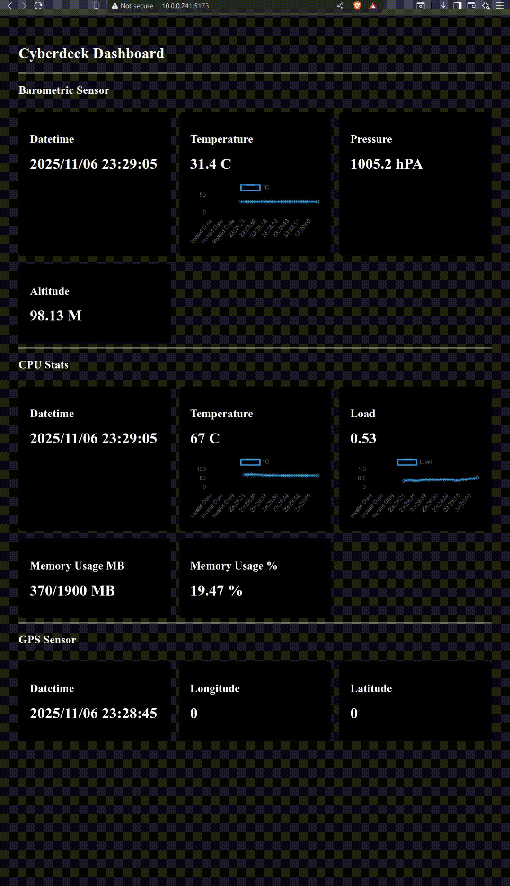
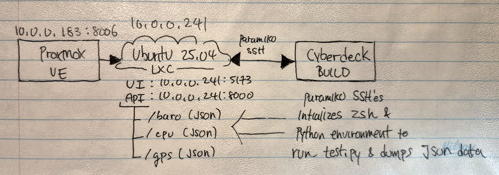
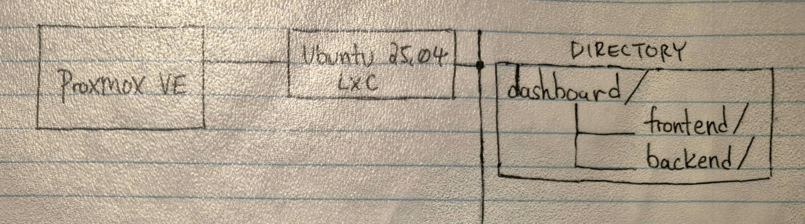

# Web Dashboard
A remote dashboard that runs the startup script on the cyberdeck and displays sensor data 

> startup script is different from main as it does not log data and sends JSON data to the dashboard

Using a **ThinkCentre M700** running **[Proxmox VE](https://www.proxmox.com/en/)**. An **LXC container** running **Ubuntu 25.04 with 2GB memory and 1GB swap**



**[[Link to a tutorial that helped build this dashboard]](https://testdriven.io/blog/flask-svelte/)**

### Software
* **[Proxmox](https://www.proxmox.com/en/)**
* **[Test Script](./test.py)**

#### Frontend
* **[Svelte](https://svelte.dev/)**
* **SvelteKit**

#### Backend
* **[Flask](https://flask.palletsprojects.com/en/stable/)**
* **JSON**
* **[Paramiko](https://www.paramiko.org/)**

### Hardware
* **Lenovo ThinkCentre M700**

### Diagrams

#### Proxmox Web Directory


#### How Proxmox Interacts With The Cyberdeck



### Startup
```
cd web_dashboard/
npm install
npm run dev  
```